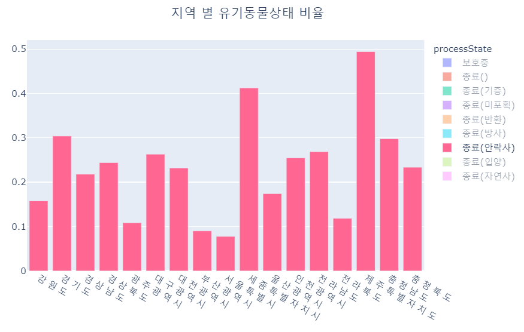

# 개별프로젝트 1 - 전국 유기동물, 보호소, 동물병원 현황 시각화 및 상관관계 분석

# Why?

-   반려동물을 키우는 사람이 많아지는 만큼 반려동물을 유기하는 사람의 수 또한 증가하고 있다.

-   유기된 반려동물은 공고날짜 10일이 지나면 언제든지 안락사가 가능하며 유기된 동물의 절반정도 가량이 죽어가고 있다.

-   이에 대한 자료들을 시각화 하여 동물 유기의 경각심을 주고 동물 유기의 원인을 찾기위한 상관분석 진행하고자 하였다.

# Purpose

-   시각화 ( Dash를 사용하여 웹 구현 )

    -   유기동물
        -   지역별 유기동물 수 현황을 버블맵 방식을 활용하여 한 눈에 들어오도록 시각화 진행
        -   지역별로 유기동물상태를 비율로 환산하여 시각화 한다. (입양율이 높을지 안락사 비율이 높을지)
        -   지역별로 비율을 자세히 볼 수 있도록 파이그래프를 활용하여 시각화
        -   유기동물의 대부분을 차지하는 개와 고양이의 진행상태를 시각화
    -   동물보호센터
        -   지역별 동물보호센터 수 현황을 버블맵 방식을 활용하여 시각화
        -   위도, 경도 데이터가 존재하는 동물보호센터는 정확한 위치를 지도에 표현
        -   지역별로 동물보호센터의 유형(개인/단체/동물병원/법인)의 비율 시각화
        -   시/도 별 동물보호센터수 비율 시각화
    -   동물병원
        -   지역별 동물병원 수 현황을 버블맵 방식을 활용하여 시각화
        -   파이그래프와 막대그래프를 활용하여 지역별 동물병원 수와 비율 시각화

-   상관분석
    -   유기동물 수, 동물보호센터 수, 동물병원 수 와 유기동물의 상태들의 상관계수를 구한다.
    -   상관계수를 보고 어떤 요인이 유기동물 수와 상태에 영향을 많이 주는지 분석한다.

# Data

### 공공데이터 포털 open API

-   유기동물 데이터 (약 100만 건)
    -   [유기동물](./files/유기동물.docx) 참조 ( 5.유기동물 조회 오퍼레이션)
-   동물보호센터 데이터 (251 건)

    -   [동물보호센터](./files/동물보호센터.docx) 참조

### Crawling

-   동물병원 데이터 (약 5000 건)
    -   [동물보호관리시스템](https://www.animal.go.kr/) -> 업체정보 -> 동물병원 데이터 -> crawling

### Blog

-   전국 시군구별 위도 경도 데이터 (버블맵을 사용하기 위한)
    -   [파이썬 전국 인구 현황 지도 그리기](https://mkjjo.github.io/python/2019/08/18/korea_population.html) 참조

# Web

# Analysis

### 시각화 자료 분석

-   세종특별자치시와 제주특별자치도에서 안락사 비율이 40%이상 이다.
-   이들의 동물보호센터 수와 동물병원 수를 살펴보자.

-   동물보호센터 수 역시 가장 적은 두 지역이 세종특별자치시와 제주특별자치도이다.

-   동물병원 수 역시 가장 적은 두 지역이 세종특별자치시와 제주특별자치도이다.

이들의 상관계수를 분석해 보자.

# Results

### 상관계수 분석

-   보호소 수, 유기동물 수, 동물병원 수의 상관관계가 높게 나왔다.
-   보호소 수와 유기동물 수는 보호소가 많을 수록 유기동물을 많이 보호해서 강한 양의 상관관계가 있다.
-   유기동물 수와 동물병원 수의 상관관계가 높게 나온 이유는 동물병원중에 동물보호센터를 같이 운영하는 곳이 많아서 발생한 결과로 예상한다.

# Improvements

### Web

-   버블맵으로 시각화 하는 과정에서 전국 시군구별 위도 경도 데이터 없거나 지명이 변경된 지역에 대해 데이터 손실이 발생하였다.
-   하지만, 버블맵을 제외한 시각화 자료에선 데이터 손실이 없었다.

### Analysis

-   예측과 다른 결과로 새로운 가설을 설정하여 추가 분석 필요
